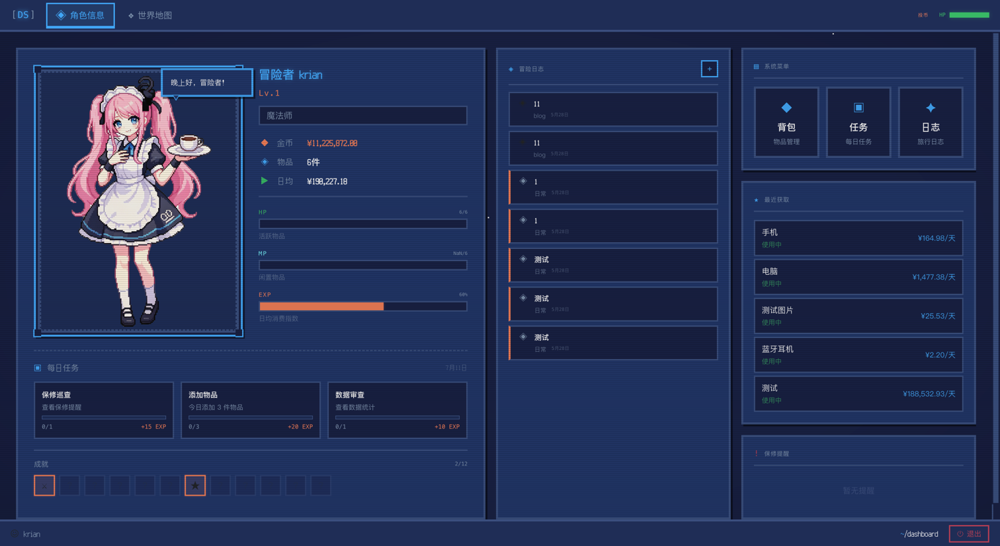

# PixelPack

一款 RPG 像素风格的个人物品管理与日常追踪系统。将你的物品、消费、任务以游戏化的方式管理起来。



## 功能

- **物品管理** — 记录物品信息（价格、购买渠道、保修期、标签分类），自动计算日均成本
- **角色系统** — 上传立绘、设置角色名和职业、记录生日与星座
- **每日任务** — 自动生成的每日任务（添加物品、记录消费等），完成后获得 EXP
- **成就系统** — 收集类成就（首次添加、收集达人等），解锁后记录到冒险日志
- **冒险日志** — 自动记录系统事件 + 用户手动写日志，RPG 风格时间线
- **世界地图** — AI 技术情报的每日推送与历史回溯，按六大知识疆域（大模型/智能体/视觉/基建/研究/工具）分类（前端 + Mock，后端待接入）
- **数据统计** — 消费趋势、物品状态分布、保修提醒等可视化图表
- **像素风 UI** — 基于 NES.css 的像素艺术主题，Press Start 2P / Ark Pixel 字体

## 技术栈

| 层 | 技术 |
|---|------|
| 前端 | Vue 3.5 + TypeScript + Pinia 3 + Vue Router 4 + Vite 8 |
| 后端 | FastAPI + SQLAlchemy 2.0 (async) + SQLite (aiosqlite) |
| 认证 | JWT (access + refresh token) |
| 图表 | ECharts 6 |
| 风格 | NES.css + 自定义像素风组件 |

## 项目结构

```
PixelPack/
├── server/                # Python 后端
│   ├── app/
│   │   ├── main.py        # FastAPI 入口，路由注册，静态文件
│   │   ├── config.py      # 配置（数据库、密钥、上传目录）
│   │   ├── database.py    # SQLAlchemy async 引擎 + Session
│   │   ├── models/        # ORM 模型（User, Item, Journal, Quest...）
│   │   ├── schemas/       # Pydantic 请求/响应模型
│   │   ├── services/      # 业务逻辑层
│   │   ├── routers/       # API 路由（REST 端点）
│   │   └── utils/         # JWT、密码哈希、依赖注入
│   └── requirements.txt
├── web/                   # Vue 前端
│   ├── src/
│   │   ├── api/           # ofetch API 封装
│   │   ├── components/    # 可复用组件（PixelDatePicker 等）
│   │   ├── layouts/       # 页面布局（AuthLayout, MainLayout）
│   │   ├── router/        # 路由配置 + 导航守卫
│   │   ├── stores/        # Pinia 状态管理（auth, notification）
│   │   ├── styles/        # 全局样式（像素风主题、动画、字体）
│   │   ├── types/         # TypeScript 类型定义
│   │   ├── utils/         # 工具函数（格式化、导出、计算）
│   │   └── views/         # 页面组件（Dashboard, ItemList, Quests...）
│   └── package.json
└── uploads/               # 用户上传的图片（gitignored）
```

## 快速开始

### 环境要求

- Python 3.10+
- Node.js 24+（与 `web/Dockerfile` 的 `node:24-alpine` 对齐）
- npm 10+

### 后端

虚拟环境创建在**项目根目录**（前后端共用一个仓库，Python 仅用于后端）：

```bash
# 在项目根目录
python -m venv .venv
source .venv/bin/activate   # Windows: .venv\Scripts\activate
pip install -r server/requirements.txt
```

启动开发服务器（⚠️ 必须在 `server/` 目录下运行，因为 `DATABASE_URL` 和 `UPLOAD_DIR` 是相对路径）：

```bash
cd server
uvicorn app.main:app --reload --port 8000 --log-config app/uvicorn_log_config.json
```

启动后访问 `http://127.0.0.1:8000/docs` 查看 API 文档。

### 前端

```bash
cd web
npm install
npm run dev
```

前端开发服务器运行在 `http://localhost:3000`，自动代理 `/api` 和 `/uploads` 到后端 `http://127.0.0.1:8000`。

### 生产构建（容器化）

前端已纳入 Docker 多阶段构建（`web/Dockerfile`：`node` 构建 → `nginx` 静态服务），**生产环境无需在宿主机跑 `npm run build`**，由 `docker compose up -d --build web` 完成。本地开发仍用上面的 `npm run dev`。

## Docker 部署（生产推荐）

通过 `docker-compose.yml` 拉起 `api`（FastAPI/uvicorn）与 `web`（多阶段 nginx 静态）两个容器，均接入共享网络 `airise-web`；外部访问由独立的 `airise-gateway` 网关统一终结 TLS 并反代。

```bash
git clone https://github.com/LunaticKrian/PixelPack.git
cd PixelPack

# 1. 配置密钥（不进 git、不进镜像，仅运行时注入）
cp server/.env.example server/.env
vi server/.env          # 填入 ANTHROPIC_AUTH_TOKEN

# 2. 构建并启动 api + web（建议直接在服务器上构建，见下方说明）
docker compose up -d --build
```

常用命令：

```bash
docker compose ps            # 查看状态（api、web）
docker compose logs -f api   # 后端日志
git pull && docker compose up -d --build   # 更新代码（./data 数据不丢）
```

**部署架构**

```
浏览器 ──https──▶ airise-gateway（独立项目，独占 80/443，TLS 终结）
                    ├─ /api/      ──▶ pixelpack-api:8000   （本 compose）
                    ├─ /uploads/  ──▶ 宿主机 data/uploads 直发
                    └─ /          ──▶ pixelpack-web:80     （本 compose，SPA 静态）

┌─ docker-compose（本项目）──────────────────────────────┐
│  web (nginx:alpine)        ← 多阶段：node build→nginx  │
│   └─ serve /usr/share/nginx/html（SPA 回退+gzip+缓存）  │
│  api (uvicorn) :8000                                    │
│   └─ FastAPI + APScheduler                              │
│                                                          │
│  volumes:  ./data → /app/data                           │
│            ├─ data.db                                    │
│            └─ uploads/   （网关只读挂载直发）            │
│  networks: airise-web（external，与网关互通）            │
└──────────────────────────────────────────────────────────┘
```

**注意事项**

- **持久化**：`data.db` 与 `uploads/` 全部落入 `./data`（bind mount），容器重建/升级不丢数据，备份只需 `tar czf backup.tar.gz data/`。
- **密钥**：`.env` 由 compose 的 `env_file` 注入；镜像可安全 push 到公开仓库。
- **网关**：`airise-gateway` 是**独立项目/独立仓库**（不再放在本项目 `nginx/` 下），负责 TLS、`/api` 反代、`/uploads` 直发、`/` 反代到 `web` 容器。网关配置与部署见 airise-gateway 仓库 README。
- **⚠️ 捆绑二进制平台一致性**：`claude-agent-sdk` 内含一个 glibc 原生二进制（约 240MB），故后端镜像**不能用 alpine**，且**构建平台须等于运行平台**。在 Apple Silicon 上构建、跑在 amd64 服务器时需 `docker buildx build --platform linux/amd64`，最稳妥仍是直接在服务器上 `docker compose build`。

完整步骤、密钥安全讨论、HTTPS/域名扩展、故障排查见 **[docs/deployment/deploy.md](docs/deployment/deploy.md)**。

## 文档

| 文档 | 内容 |
|------|------|
| [docs/deployment/deploy.md](docs/deployment/deploy.md) | 完整部署流程：web 容器构建 → 后端部署 → 网关更新，含验证、日常更新、备份、故障速查 |
| [docs/technology/260719-nginx部署架构.md](docs/technology/260719-nginx部署架构.md) | 网关托管模式架构（统一入口、共享网络、通配证书、多项目接入） |
| [docs/technology/260719-新服务上线与网关扩展.md](docs/technology/260719-新服务上线与网关扩展.md) | 新项目接入 SOP：后端容器接入 `airise-web`、由 `_template.example` 生成站点配置、扩展网关 |
| [docs/technology/260719-通配证书签发.md](docs/technology/260719-通配证书签发.md) | `*.airise.site` 通配证书 DNS-01 签发、自动续期 hook、单域→通配迁移、故障速查 |
| [docs/updatelog.md](docs/updatelog.md) | 仓库更新日志 |
| airise-gateway 仓库 README | 网关容器（`airise-gateway`，独立项目）说明 |

## API 概览

| 路径前缀 | 说明 |
|----------|------|
| `/api/auth` | 注册、登录、Token 刷新、个人信息更新 |
| `/api/items` | 物品 CRUD、图片上传、状态变更、CSV 导出 |
| `/api/categories` | 分类管理 |
| `/api/tags` | 标签管理 |
| `/api/journals` | 冒险日志（系统自动 + 手动创建） |
| `/api/quests` | 每日任务进度、成就查询 |
| `/api/stats` | 数据总览、最近物品、保修提醒 |

所有需要认证的端点使用 `Authorization: Bearer <token>` 头部。

## 配置

后端配置通过环境变量或 `server/.env` 文件：

```env
DATABASE_URL=sqlite+aiosqlite:///./data.db
SECRET_KEY=your-secret-key
ACCESS_TOKEN_EXPIRE_MINUTES=60
REFRESH_TOKEN_EXPIRE_DAYS=7
UPLOAD_DIR=uploads
```

## License

MIT
